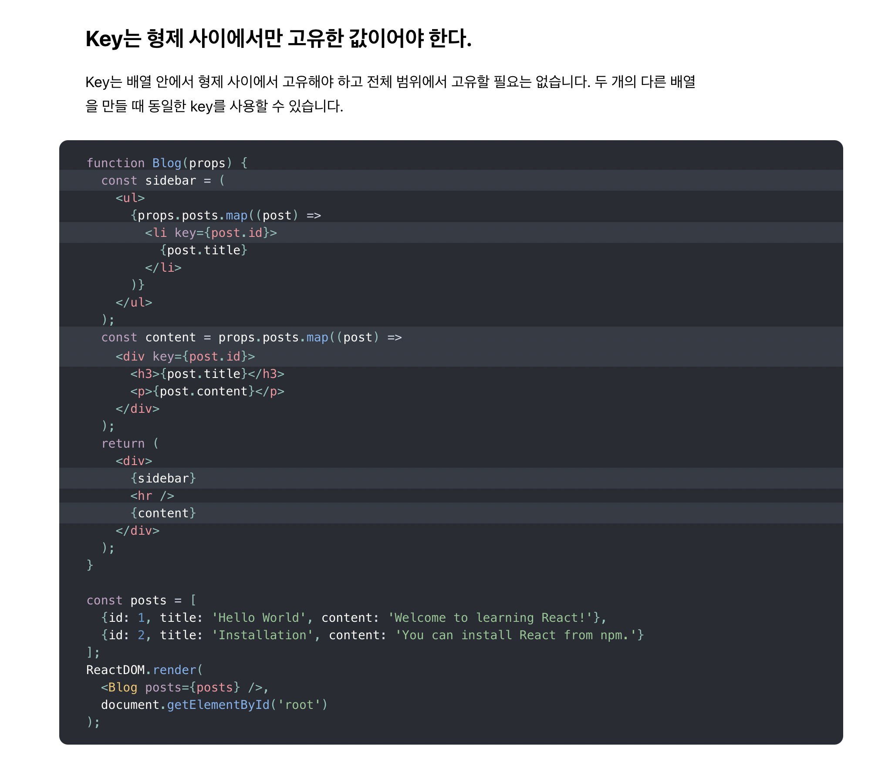

# Dive To React

## Steps

#### `webpack` + `babel` + `react` + `typescript` 개발환경 설정하기.

```bash
# 현재 디렉토리에 npm 활성화
$ npm init -y
```

```bash
# 현재 디렉토리에 git 활성화
$ git init
```

```bash
# 현재 디렉토리에 typescript 활성화
$ tsc --init
```

```bash
# 현재 디렉토리에 eslint
$ eslint --init
```

```bash
# 현재 디렉토리에 webpack 설치
$ npm install webpack webpack-cli webpack-dev-server webpack-merge webpack-bundle-analyzer -D
```

```bash
# webpack 스타일시트 전처리 로더 및 플러그인 설치
$ npm install mini-css-extract-plugin css-loader sass-loader sass -D
$ npm install html-webpack-plugin -D
```

```bash
# 트랜스파일링을 위한 babel 설치
$ npm install @babel/core @babel/preset-env @babel/preset-react @babel/preset-typescript @babel/cli core-js babel-loader -D
```

```bash
# typescript 설치
$ npm install typescript ts-loader -D
```

```bash
# react, react-dom 설치
$ npm install react react-dom
```

#### `Official Document` 리딩.

- `JSX`

- `엘리먼트 렌더링`

- `Component, Props`

    - `componentDidMount`

        - 네트워크 요청의 시작점
        - DOM 접근의 시작점

    - `componentDidUpdate`

        - 동일한 컴포넌트와 동일한 라우팅 경로상황에서 쿼리 파라미터만 변하는 경우에 유용함.

    - `componentWillUnmount`

        - 더이상 사용하지 않는 자원의 해제

    - `componentDidCatch`

    - `shouldComponentUpdate`
  
      - 리렌더링 최적화 작업을 진행하기 위해 사용했던 것으로 기억함.

- `State와 생명주기`

    - [Typing-Class-Component](./docs/Typing-Class-Components/readme.md)

| 상태 업데이트의 비동기성 | 상태 업데이트의 병합 |
| :-----------: | :-----------: |
|  |  |

- `이벤트 처리하기`

    - 리액트의 이벤트는 고유의 합성 이벤트 객체를 이용, 브라우저마다 다른 명세를 지니지 않도록 한다.

    - 이벤트 기본동작은 반드시 `event.preventDefault()` 를 호출할 것.

    - 이벤트 핸들러에 아래와 같이 바인딩하여 `this` 가 생성된 인스턴스 자신을 가르키도록 할 것.

    ```ts
        class Clock extends React.Component<clockProps, clockState>{
              constructor (props: ClockProps) {
                super(props)
                this.state = {
                    currentTime: new Date().toLocaleTimeString(),
                    clockTimerId: null
                }
                this.startClock = this.startClock.bind(this)
                this.stopClock = this.stopClock.bind(this)
            }
        }
    ```
- `조건부 렌더링`

    - 기호에 따라, 삼항 연산, 조건부 렌더링 컴포넌트, 제어문을 통해 처리할 수 있다.

    - 조건의 복잡도와 내용이 많아지는 경우 해당 내용을 컴포넌트로 분리하여 스플리팅 처리를 고려해볼 수 있다.

- `리스트와 Key`

    - [List-With-Key](./docs/List-With-Key/readme.md)

| 리스트 키 콘텍스트 |
| :-----------: |
|  |

- `폼`

    - 개별 폼 요소에 하나의 핸들러를 입력하는 과정이 부담스럽다면 `name` 프로퍼티를 지정해서 해결 할 수 있다.
    
    ```ts
    handleInputChange(event) {
        const target = event.target;
        const name = target.name;

        this.setState({
            [name]: value
        });
    }
    ```

- `State 끌어올리기`

    - 공통 부모를 갖는 두 자식 요소간에서 서로의 변경점이 다른 하나에 반영되어야 한다면 공통 부모쪽에 `state` 를 배치하고 자식 요소가 `props` 로 부모의 상태값을 받아 갱신하도록 처리해 볼 것.

- `합성과 상속`

    - `props.children` 을 통해 부모컴포넌트가 입력한 JSX 템플레이트를 그대로 전달할 수 있다. 컴파일은 부모 컴포넌트 시점에서 진행되는 것에 유의.
  
    - `props.key` 에도 컴포넌트를 할당하여 전달 및 렌더링 할 수 있다.

- `React로 생각하기`