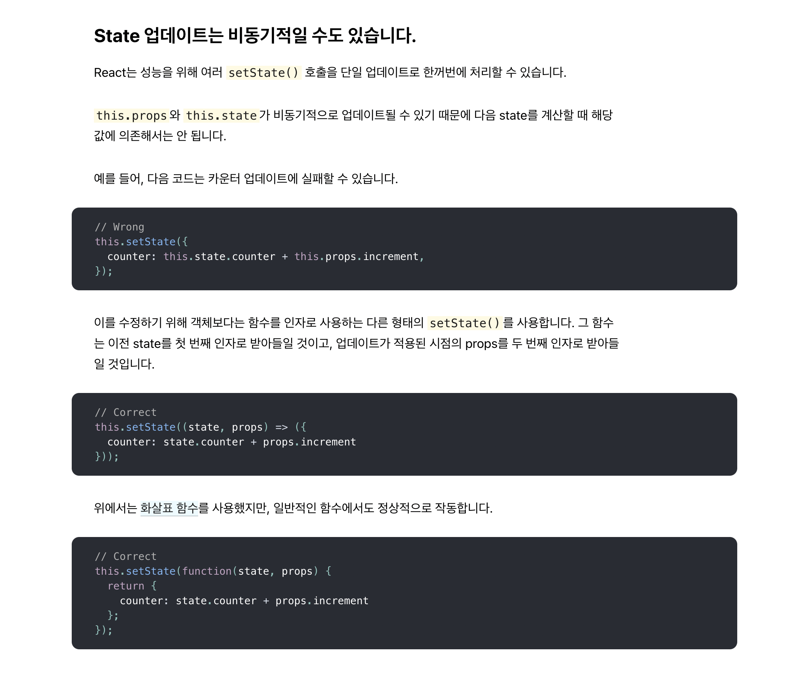
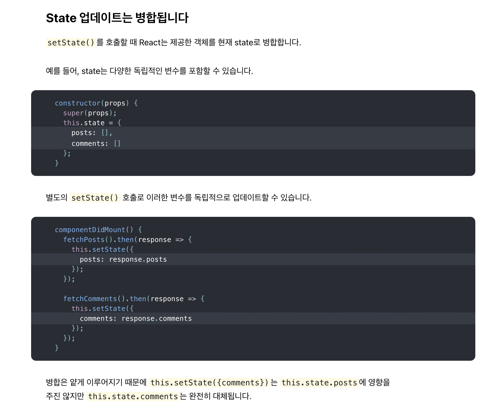

# Dive To React

## Steps

#### `webpack` + `babel` + `react` + `typescript` 개발환경 설정하기.

```bash
# 현재 디렉토리에 npm 활성화
$ npm init -y
```

```bash
# 현재 디렉토리에 git 활성화
$ git init
```

```bash
# 현재 디렉토리에 typescript 활성화
$ tsc --init
```

```bash
# 현재 디렉토리에 eslint
$ eslint --init
```

```bash
# 현재 디렉토리에 webpack 설치
$ npm install webpack webpack-cli webpack-dev-server webpack-merge webpack-bundle-analyzer -D
```

```bash
# webpack 스타일시트 전처리 로더 및 플러그인 설치
$ npm install mini-css-extract-plugin css-loader sass-loader sass -D
$ npm install html-webpack-plugin -D
```

```bash
# 트랜스파일링을 위한 babel 설치
$ npm install @babel/core @babel/preset-env @babel/preset-react @babel/preset-typescript @babel/cli core-js babel-loader -D
```

```bash
# typescript 설치
$ npm install typescript ts-loader -D
```

```bash
# react, react-dom 설치
$ npm install react react-dom
```

#### `Official Document` 리딩.

- `JSX`

- `엘리먼트 렌더링`

- `Component, Props`

    - `componentDidMount`

    - `componentDidUpdate`

    - `componentWillUnmount`

    - `componentDidCatch`

    - `shouldComponentUpdate`
  
      - 리렌더링 최적화 작업을 진행하기 위해 사용했던 것으로 기억함.

- `State와 생명주기`

| 상태 업데이트의 비동기성 | 상태 업데이트의 병합 |
| :-----------: | :-----------: |
|  |  |

