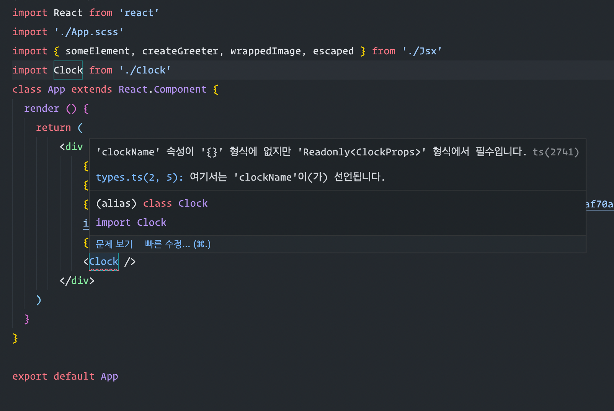

## Typing-Class-Components

### Reason

- 클래스 문법으로 작성한 리액트 컴포넌트의 `Props`, `State` 타입 부재를 확인.

#### Example

제네릭 타입 혹은 인터페이스를 입력받을 수 있게 작성되어 있다.

```ts
React.Compoent<PropType, StateType>
```

따라서, 직접 작성해본 `Clock` 인터페이스도 다음처럼 입력해줄 수 있다.

```ts
export interface ClockProps {
    clockName: string;
}

export interface ClockState {
    currentTime: string;
    clockTimerId: ReturnType<typeof setTimeout> | null
}

// State 인터페이스는 타입 설정 과정에서 ReadOnly로 취급되므로 타입 정의 단계에서 ReadOnly 키워드를 명시할 필요는 없다.
export default class Clock extends React.Component<ClockProps, ClockState> {}
```


#### Effect

`ClockProps.clockName` 이 `Optional` 이 아니기 때문에 에디터 상에서 개발하는 과정에서 오류로 발생하게 된다.  
개발자는 이 오류를 확인하고 수정하는 과정을 통해 런타임에 해당 이슈를 발견하는 상황을 겪지 않는 효과를 얻는다.



#### Reference

- [Class Components](https://react-typescript-cheatsheet.netlify.app/docs/basic/getting-started/class_components)